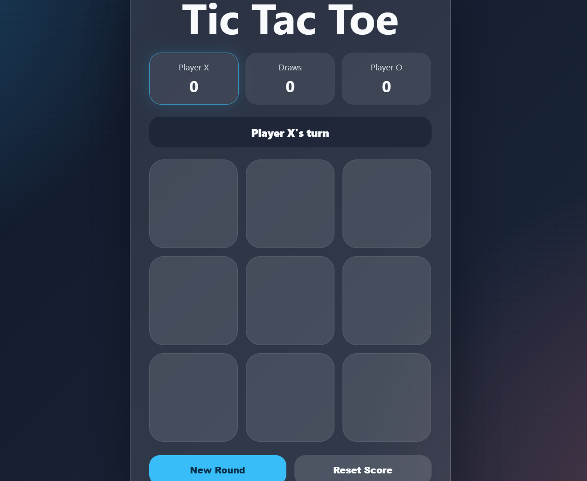

# Tic Tac Toe Game

A simple and responsive Tic Tac Toe game built with HTML, CSS, and vanilla JavaScript.

## Preview

> Add a screenshot here later if you want:
>
> 
>
Check here : https://imran-8.github.io/Tic-Tac-Toe-game/

## Features

- Two-player gameplay
- Win detection
- Draw detection
- Score tracking for X, O, and draws
- New round button
- Reset score button
- Responsive design
- No external libraries

## Tech Stack

- HTML
- CSS
- JavaScript

## How to Run

1. Clone the repository:

```bash
git clone https://github.com/IMRAN-8/Tic-Tac-Toe-game.git
